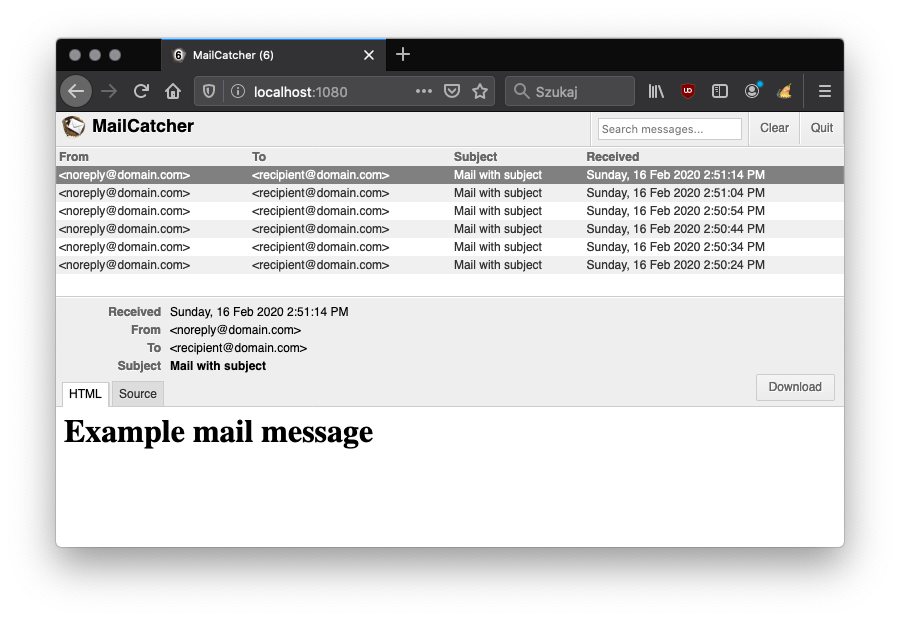

Mailcatcher
========================
Yet another implementation of containerized [https://mailcatcher.me/](https://mailcatcher.me/)

Docker Image
------------
[](https://microbadger.com/images/slydeveloper/mailcatcher "Get your own image badge on microbadger.com")<br />
[](https://microbadger.com/images/slydeveloper/mailcatcher "Get your own version badge on microbadger.com")<br />
[](https://hub.docker.com/r/slydeveloper/mailcatcher)

Info
----
- Name: `slydeveloper/mailcatcher`
- Version: `latest`,`1.0`
- [Docker Hub](https://hub.docker.com/r/slydeveloper/mailcatcher/)

Details
--------
- Image based on `ruby:2.7-alpine`
- Pre-installed packages:
  - `mailcatcher 0.7.1`

Usage
--------
```docker run --rm -p 1025:1025 -p 1080:1080 slydeveloper/mailcatcher```

Screenshot
-----

